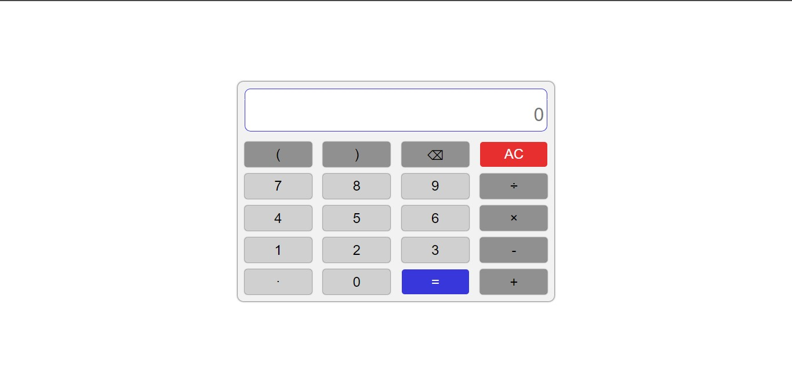
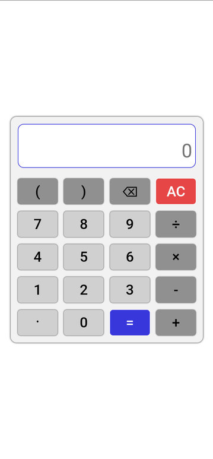

The main objective of this project is to implement react concepts. This is not the efficient way to implement calculator.

This project implements react's:
* usestate
* createcontext
* usecontext

```html
<Dataprovider>
	<Display></Display>
	<div className="buttonhoder">
	{data.map((props) => <Button key={props.id} prop={props}></Button>)}
	</div>
</Dataprovider>
````

```<Dataprovider>``` will provide the necessary data for the react components ```<Display>``` and ```<Button>```.

## Screenshots:

### Desktop


### Moble


## Setup

```bash
npm i # To install dependency
npm start # To run the project
```
